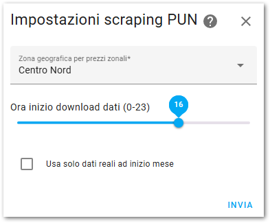
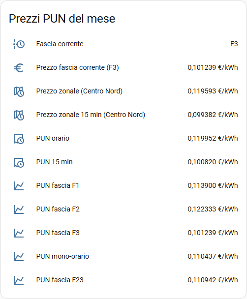
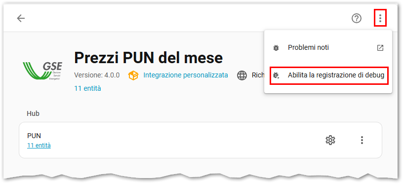

# Prezzi PUN del mese

[](https://github.com/hacs/integration)

[](https://github.com/virtualdj/pun_sensor/actions/workflows/validate.yaml)
[](https://github.com/virtualdj/pun_sensor/releases)

Integrazione per **Home Assistant** (basata sullo script [pun-fasce](https://github.com/virtualdj/pun-fasce)) che mostra i prezzi stimati del mese corrente per fasce orarie (F1, F2 e F3 e mono-oraria) nonché la fascia oraria attuale.

I valori vengono scaricati dal sito [MercatoElettrico.org](https://storico.mercatoelettrico.org/It/Default.aspx) per l'intero mese e viene calcolata la media per fasce giorno per giorno, in questo modo verso la fine del mese il valore mostrato si avvicina sempre di più al prezzo reale del PUN in bolletta (per i contratti a prezzo variabile).

## Installazione in Home Assistant

Installare usando [HACS](https://hacs.xyz/) tramite il menu con i tre puntini nell'angolo in alto a destra e scegliendo _Add custom repository_ e aggiungendo l'URL https://github.com/virtualdj/pun_sensor alla lista.

Installare **manualmente** clonando o copiando questa repository e poi copiando la cartella `custom_components/pun_sensor` nella cartella `/custom_components/pun_sensor` di Home Assistant, che andrà successivamente riavviato.

### Configurazione

Dopo l'aggiunta dell'integrazione oppure cliccando il pulsante _Configurazione_ nelle impostazioni di Home Assistant, verrà visualizzata questa finestra:



Qui è possibile selezionare un'ora del giorno in cui scaricare i prezzi aggiornati dell'energia (default: 1). Nel caso il sito non fosse raggiungibile, verranno effettuati altri tentativi dopo 10, 60, 120 e 180 minuti.

Se la casella di controllo _Usa solo dati reali ad inizio mese_ è **attivata**, all'inizio del mese quando non ci sono i prezzi per tutte le fasce orarie questi vengono disabilitati (non viene mostrato quindi un prezzo in €/kWh finché i dati non sono in numero sufficiente); nel caso invece la casella fosse **disattivata** (default) nel conteggio vengono inclusi gli ultimi giorni del mese precedente in modo da avere sempre un valore in €/kWh.

### Aggiornamento manuale

È possibile forzare un **aggiornamento manuale** richiamando il servizio _Home Assistant Core Integration: Aggiorna entità_ (`homeassistant.update_entity`) e passando come destinazione una qualsiasi entità tra quelle fornite da questa integrazione: questo causerà chiaramente un nuovo download dei dati.

### Aspetto dei dati



L'integrazione fornisce il nome della fascia corrente relativa all'orario di Home Assistant (tra F1 / F2 / F3), i prezzi delle tre fasce F1 / F2 / F3 più la fascia mono-oraria e il prezzo della fascia corrente.

### Prezzo al dettaglio

Questo componente fornisce informazioni sul prezzo all'**ingrosso** dell'energia elettrica: per calcolare il prezzo al dettaglio, è necessario creare un sensore fittizio (o _template sensor_), basato sui dati specifici del proprio contratto con il fornitore finale aggiungendo tasse e costi fissi.

Di seguito un esempio di un sensore configurato manualmente modificando il file `configuration.yaml` di Home Assistant:

```yml
# Template sensors section
template:
  - sensor:
      - unique_id: prezzo_attuale_energia_al_dettaglio
        name: "Prezzo attuale energia al dettaglio"
        icon: mdi:currency-eur
        unit_of_measurement: "€/kWh"
        state: >
          {{ (1.1 * (states('sensor.pun_prezzo_fascia_corrente')|float(0) + 0.0087 + 0.04 + 0.0227))|round(3) }}
```

### Fascia F23

A partire dalla versione v0.5.0, è stato aggiunto il sensore relativo al calcolo della fascia F23, cioè quella contrapposta alla F1 nella bioraria. Il calcolo non è documentato molto nei vari siti (si veda [QUI](https://github.com/virtualdj/pun_sensor/issues/24#issuecomment-1806864251)) e non è affatto la media dei prezzi in F2 e F3 come si potrebbe pensare: c'è invece una percentuale fissa, [come ha scoperto _virtualj_](https://github.com/virtualdj/pun_sensor/issues/24#issuecomment-1829846806).
Pertanto, seppur questo metodo non sia ufficiale, è stato implementato perché i risultati corrispondono sempre alle tabelle pubblicate online.

### In caso di problemi

È possibile abilitare la registrazione dei log tramite l'interfaccia grafica in **Impostazioni > Dispositivi e servizi > Prezzi PUN del mese** e cliccando sul pulsante **Abilita la registrazione di debug**.



Il tasto verrà modificato come nell'immagine qui sotto:


Dopo che si verifica il problema, premerlo nuovamente: in questo modo verrà scaricato un file di log con le informazioni da allegare alle [Issue](https://github.com/virtualdj/pun_sensor/issues).

## Note di sviluppo

Ho lasciato un diario dell'esperienza di programmazione di questa integrazione in [questa pagina](DEVELOPMENT.md). Potrete trovare qualche lamentela ma soprattutto link alle pagine dei progetti che mi hanno aiutato a svilupparla così com'è ora.
